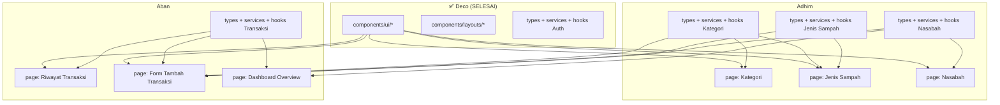

# 📋 Panduan Implementasi — Adhim & Aban

> Dokumen ini berisi **semua yang perlu kalian ketahui** untuk langsung coding tanpa perlu riset tambahan. Setiap file, setiap baris, setiap alur sudah dijelaskan.

---

## 🏗️ Arsitektur Yang Harus Dipatuhi

Sebelum mulai, pahami aturan ini:

```
Halaman (page.tsx)
    ↓ panggil
Hook (hooks/useXxx.ts)          ← Mengatur state: loading, error, data
    ↓ panggil
Service (services/xxx.service.ts)   ← Menjalankan HTTP request
    ↓ panggil
API Client (services/api.client.ts) ← Base fetch helper (SUDAH DIBUAT Deco)
```

> [!CAUTION]
> **DILARANG** menulis `fetch('/api/...')` langsung di halaman (`page.tsx`) atau di hook. Semua URL API **HANYA** ditulis di folder `services/`.

---

## 🧩 Komponen UI Buatan Deco Yang Harus Dipakai

Berikut komponen yang sudah siap di `components/ui/`. **JANGAN** buat ulang komponen ini.

### 1. `Button` — Tombol

```tsx
import Button from "@/components/ui/Button";

// Contoh penggunaan:
<Button variant="primary" size="lg" isLoading={saving}>Simpan</Button>
<Button variant="secondary" onClick={handleCancel}>Batal</Button>
<Button variant="danger" size="sm" onClick={handleDelete}>Hapus</Button>
<Button variant="ghost" icon={<PlusIcon />}>Tambah Item</Button>
```

| Prop | Tipe | Pilihan | Default |
|------|------|---------|---------|
| `variant` | string | `primary`, `secondary`, `danger`, `ghost` | `primary` |
| `size` | string | `sm`, `md`, `lg` | `md` |
| `isLoading` | boolean | — | `false` |
| `fullWidth` | boolean | — | `false` |
| `icon` | ReactNode | — | — |

### 2. `Input` — Kolom Isian

```tsx
import Input from "@/components/ui/Input";

<Input
  label="Nama Nasabah"
  value={nama}
  onChange={(e) => setNama(e.target.value)}
  error={errors.nama}          // Tampil pesan merah jika ada
  placeholder="Masukkan nama"
  required
/>
<Input label="Harga/Kg" type="number" value={harga} onChange={...} />
```

### 3. `SelectAutocomplete` — Dropdown Pencarian

```tsx
import SelectAutocomplete from "@/components/ui/SelectAutocomplete";

const options = [
  { value: "uuid-1", label: "Plastik" },
  { value: "uuid-2", label: "Kertas" },
];

<SelectAutocomplete
  label="Kategori Sampah"
  options={options}
  value={selectedId}
  onChange={(val) => setSelectedId(val)}
  placeholder="Pilih kategori..."
  searchable        // Bisa diketik untuk cari
  error={errors.kategori}
/>
```

### 4. `Modal` — Popup Form

```tsx
import Modal from "@/components/ui/Modal";

<Modal isOpen={showModal} onClose={() => setShowModal(false)} title="Tambah Data" size="lg">
  {/* Isi form di sini */}
  <form>...</form>
</Modal>
```

| Prop | Tipe | Pilihan | Default |
|------|------|---------|---------|
| `isOpen` | boolean | — | — |
| `onClose` | function | — | — |
| `title` | string | — | — |
| `size` | string | `sm`, `md`, `lg`, `xl` | `md` |

### 5. `Table` — Tabel Data

```tsx
import Table, { type TableColumn } from "@/components/ui/Table";

// Definisikan kolom:
const columns: TableColumn<Nasabah>[] = [
  { key: "kode_nasabah", header: "Kode" },
  { key: "nama", header: "Nama Nasabah" },
  {
    key: "saldo",
    header: "Saldo",
    render: (row) => `Rp ${row.saldo.toLocaleString("id-ID")}`, // Custom render
  },
  {
    key: "aksi",
    header: "Aksi",
    render: (row) => (
      <div className="flex gap-2">
        <Button size="sm" variant="secondary" onClick={() => handleEdit(row)}>Edit</Button>
        <Button size="sm" variant="danger" onClick={() => handleDelete(row.id_nasabah)}>Hapus</Button>
      </div>
    ),
  },
];

// Render:
<Table
  columns={columns}
  data={nasabahList}
  isLoading={isLoading}
  emptyMessage="Belum ada data nasabah."
  rowKey="id_nasabah"     // Field unik untuk key
/>
```

### 6. `Card` — Kartu Pembungkus

```tsx
import Card from "@/components/ui/Card";

<Card
  title="Daftar Nasabah"
  subtitle="Total: 150 nasabah aktif"
  action={<Button onClick={() => setShowModal(true)}>+ Tambah</Button>}
>
  <Table ... />
</Card>
```

### 7. `apiClient` — HTTP Helper

```tsx
import { apiClient } from "@/services/api.client";

// Sudah tersedia method:
apiClient.get<T>(url)        // GET request
apiClient.post<T>(url, body) // POST request
apiClient.put<T>(url, body)  // PUT request
apiClient.delete<T>(url)     // DELETE request

// Otomatis: set Content-Type JSON, parse response, throw error jika gagal
```

---

---

# 👤 BAGIAN ADHIM — Master Data

## Ringkasan Tugas Adhim

| Halaman | Folder | Fitur |
|---------|--------|-------|
| Kategori Sampah | `app/dashboard/kategori/` | Daftar + Tambah + Edit + Hapus |
| Jenis Sampah | `app/dashboard/jenis-sampah/` | Daftar + Tambah + Edit + Hapus (ada dropdown kategori) |
| Data Nasabah | `app/dashboard/nasabah/` | Daftar + Tambah + Detail/Edit + Nonaktifkan |

---

## STEP 1: Buat File Types

### File: `types/kategori-sampah.types.ts` (BUAT BARU — rename dari `jenis-sampah.types.ts` yang ada)

> [!IMPORTANT]
> Di folder `types/` belum ada file untuk kategori sampah. Kamu perlu buat file baru dan isi file yang sudah ada.

```typescript
// types/kategori-sampah.types.ts

export interface KategoriSampah {
  id_kategori: string;
  nama_kategori: string;
  deskripsi: string | null;
  is_active: boolean;
  created_at: string;
}

export interface CreateKategoriRequest {
  nama_kategori: string;
  deskripsi?: string;
}

export interface UpdateKategoriRequest {
  nama_kategori: string;
  deskripsi?: string;
  is_active: boolean;
}
```

### File: `types/jenis-sampah.types.ts`

```typescript
// types/jenis-sampah.types.ts

import type { KategoriSampah } from './kategori-sampah.types';

export interface JenisSampah {
  id_jenis_sampah: string;
  id_kategori: string;
  nama_jenis: string;
  densitas_kg_per_m3: number;
  harga_per_kg: number;
  is_active: boolean;
  created_at: string;
  kategori?: KategoriSampah;  // Relasi (dari include di backend)
}

export interface CreateJenisSampahRequest {
  id_kategori: string;
  nama_jenis: string;
  densitas_kg_per_m3: number;
  harga_per_kg: number;
}

export interface UpdateJenisSampahRequest {
  id_kategori: string;
  nama_jenis: string;
  densitas_kg_per_m3: number;
  harga_per_kg: number;
  is_active: boolean;
}
```

### File: `types/nasabah.types.ts`

```typescript
// types/nasabah.types.ts

export interface Nasabah {
  id_nasabah: string;
  kode_nasabah: string | null;
  nama: string;
  nomor_hp: string | null;
  rt: string | null;
  rw: string | null;
  saldo: number;
  total_berat_sampah: number;
  is_active: boolean;
  created_at: string;
}

export interface CreateNasabahRequest {
  kode_nasabah?: string;
  nama: string;
  nomor_hp?: string;
  rt?: string;
  rw?: string;
}

export interface UpdateNasabahRequest {
  kode_nasabah?: string;
  nama: string;
  nomor_hp?: string;
  rt?: string;
  rw?: string;
  is_active?: boolean;
}
```

---

## STEP 2: Buat File Services

### File: `services/kategori-sampah.service.ts` (BUAT BARU)

> [!NOTE]
> Belum ada file service untuk kategori. Buat baru. File `jenis-sampah.service.ts` sudah ada tapi isinya masih `// TES`.

```typescript
// services/kategori-sampah.service.ts

import { apiClient } from './api.client';
import type { KategoriSampah, CreateKategoriRequest, UpdateKategoriRequest } from '@/types/kategori-sampah.types';

/** GET /api/kategori_sampah */
export const getKategoriSampah = () =>
  apiClient.get<KategoriSampah[]>('/api/kategori_sampah');

/** POST /api/kategori_sampah */
export const createKategoriSampah = (data: CreateKategoriRequest) =>
  apiClient.post<KategoriSampah>('/api/kategori_sampah', data);

/** PUT /api/kategori_sampah/[id] */
export const updateKategoriSampah = (id: string, data: UpdateKategoriRequest) =>
  apiClient.put<KategoriSampah>(`/api/kategori_sampah/${id}`, data);

/** DELETE /api/kategori_sampah/[id] */
export const deleteKategoriSampah = (id: string) =>
  apiClient.delete<null>(`/api/kategori_sampah/${id}`);
```

### File: `services/jenis-sampah.service.ts`

```typescript
// services/jenis-sampah.service.ts

import { apiClient } from './api.client';
import type { JenisSampah, CreateJenisSampahRequest, UpdateJenisSampahRequest } from '@/types/jenis-sampah.types';

/** GET /api/jenis_sampah (bisa filter: ?id_kategori=xxx) */
export const getJenisSampah = (idKategori?: string) => {
  const query = idKategori ? `?id_kategori=${idKategori}` : '';
  return apiClient.get<JenisSampah[]>(`/api/jenis_sampah${query}`);
};

/** POST /api/jenis_sampah */
export const createJenisSampah = (data: CreateJenisSampahRequest) =>
  apiClient.post<JenisSampah>('/api/jenis_sampah', data);

/** PUT /api/jenis_sampah/[id] */
export const updateJenisSampah = (id: string, data: UpdateJenisSampahRequest) =>
  apiClient.put<JenisSampah>(`/api/jenis_sampah/${id}`, data);

/** DELETE /api/jenis_sampah/[id] */
export const deleteJenisSampah = (id: string) =>
  apiClient.delete<null>(`/api/jenis_sampah/${id}`);
```

### File: `services/nasabah.service.ts`

```typescript
// services/nasabah.service.ts

import { apiClient } from './api.client';
import type { Nasabah, CreateNasabahRequest, UpdateNasabahRequest } from '@/types/nasabah.types';

/** GET /api/nasabah (bisa filter: ?is_active=true&search=xxx) */
export const getNasabah = (params?: { is_active?: string; search?: string }) => {
  const query = new URLSearchParams();
  if (params?.is_active) query.set('is_active', params.is_active);
  if (params?.search) query.set('search', params.search);
  const qs = query.toString();
  return apiClient.get<Nasabah[]>(`/api/nasabah${qs ? `?${qs}` : ''}`);
};

/** GET /api/nasabah/[id] */
export const getNasabahById = (id: string) =>
  apiClient.get<Nasabah>(`/api/nasabah/${id}`);

/** POST /api/nasabah */
export const createNasabah = (data: CreateNasabahRequest) =>
  apiClient.post<Nasabah>('/api/nasabah', data);

/** PUT /api/nasabah/[id] */
export const updateNasabah = (id: string, data: UpdateNasabahRequest) =>
  apiClient.put<Nasabah>(`/api/nasabah/${id}`, data);

/** DELETE /api/nasabah/[id] — Soft delete (set is_active = false) */
export const deleteNasabah = (id: string) =>
  apiClient.delete<null>(`/api/nasabah/${id}`);
```

---

## STEP 3: Buat File Hooks

### File: `hooks/useKategoriSampah.ts` (BUAT BARU)

```typescript
// hooks/useKategoriSampah.ts

import { useState, useEffect, useCallback } from 'react';
import * as kategoriService from '@/services/kategori-sampah.service';
import type { KategoriSampah, CreateKategoriRequest, UpdateKategoriRequest } from '@/types/kategori-sampah.types';

export function useKategoriSampah() {
  const [data, setData] = useState<KategoriSampah[]>([]);
  const [isLoading, setIsLoading] = useState(true);
  const [error, setError] = useState<string | null>(null);

  const fetchData = useCallback(async () => {
    setIsLoading(true);
    setError(null);
    try {
      const res = await kategoriService.getKategoriSampah();
      setData(res.data);
    } catch (err: unknown) {
      setError(err instanceof Error ? err.message : 'Gagal memuat data');
    } finally {
      setIsLoading(false);
    }
  }, []);

  useEffect(() => { fetchData(); }, [fetchData]);

  const create = async (payload: CreateKategoriRequest) => {
    await kategoriService.createKategoriSampah(payload);
    await fetchData(); // Refresh data setelah tambah
  };

  const update = async (id: string, payload: UpdateKategoriRequest) => {
    await kategoriService.updateKategoriSampah(id, payload);
    await fetchData();
  };

  const remove = async (id: string) => {
    await kategoriService.deleteKategoriSampah(id);
    await fetchData();
  };

  return { data, isLoading, error, refetch: fetchData, create, update, remove };
}
```

### File: `hooks/useJenisSampah.ts`

```typescript
// hooks/useJenisSampah.ts

import { useState, useEffect, useCallback } from 'react';
import * as jenisSampahService from '@/services/jenis-sampah.service';
import type { JenisSampah, CreateJenisSampahRequest, UpdateJenisSampahRequest } from '@/types/jenis-sampah.types';

export function useJenisSampah(idKategori?: string) {
  const [data, setData] = useState<JenisSampah[]>([]);
  const [isLoading, setIsLoading] = useState(true);
  const [error, setError] = useState<string | null>(null);

  const fetchData = useCallback(async () => {
    setIsLoading(true);
    setError(null);
    try {
      const res = await jenisSampahService.getJenisSampah(idKategori);
      setData(res.data);
    } catch (err: unknown) {
      setError(err instanceof Error ? err.message : 'Gagal memuat data');
    } finally {
      setIsLoading(false);
    }
  }, [idKategori]); // ← Otomatis refetch saat idKategori berubah!

  useEffect(() => { fetchData(); }, [fetchData]);

  const create = async (payload: CreateJenisSampahRequest) => {
    await jenisSampahService.createJenisSampah(payload);
    await fetchData();
  };

  const update = async (id: string, payload: UpdateJenisSampahRequest) => {
    await jenisSampahService.updateJenisSampah(id, payload);
    await fetchData();
  };

  const remove = async (id: string) => {
    await jenisSampahService.deleteJenisSampah(id);
    await fetchData();
  };

  return { data, isLoading, error, refetch: fetchData, create, update, remove };
}
```

### File: `hooks/useNasabah.ts` (REFACTOR — sudah ada tapi langsung fetch)

```typescript
// hooks/useNasabah.ts

import { useState, useEffect, useCallback } from 'react';
import * as nasabahService from '@/services/nasabah.service';
import type { Nasabah, CreateNasabahRequest, UpdateNasabahRequest } from '@/types/nasabah.types';

export function useNasabah(params?: { is_active?: string; search?: string }) {
  const [data, setData] = useState<Nasabah[]>([]);
  const [isLoading, setIsLoading] = useState(true);
  const [error, setError] = useState<string | null>(null);

  const fetchData = useCallback(async () => {
    setIsLoading(true);
    setError(null);
    try {
      const res = await nasabahService.getNasabah(params);
      setData(res.data);
    } catch (err: unknown) {
      setError(err instanceof Error ? err.message : 'Gagal memuat data');
    } finally {
      setIsLoading(false);
    }
  }, [params?.is_active, params?.search]);

  useEffect(() => { fetchData(); }, [fetchData]);

  const create = async (payload: CreateNasabahRequest) => {
    await nasabahService.createNasabah(payload);
    await fetchData();
  };

  const update = async (id: string, payload: UpdateNasabahRequest) => {
    await nasabahService.updateNasabah(id, payload);
    await fetchData();
  };

  const remove = async (id: string) => {
    await nasabahService.deleteNasabah(id);
    await fetchData();
  };

  return {
    data,
    isLoading,
    error,
    refetch: fetchData,
    create,
    update,
    remove,
    // Backward compatibility (dashboard overview page pakai ini):
    nasabahData: data,
  };
}
```

> [!WARNING]
> **Adhim:** File `hooks/useNasabah.ts` sudah ada dan **dipakai oleh halaman Dashboard Overview** (`app/dashboard/page.tsx`) milik Aban. Saat refactor, pastikan tetap export `nasabahData` (lihat baris terakhir di atas) agar halaman Aban tidak rusak.

---

## STEP 4: Buat Halaman

### 📄 Halaman Kategori Sampah — `app/dashboard/kategori/page.tsx` (BUAT BARU)

> [!IMPORTANT]
> Folder `app/dashboard/kategori/` **BELUM ADA**. Kamu perlu buat folder dan filenya.

**Alur program halaman ini:**

```
┌──────────────────────────────────────────────────────┐
│ Halaman Kategori Sampah                              │
│                                                      │
│  1. Load → useKategoriSampah() ambil semua data      │
│  2. Render Table dengan kolom:                       │
│     [Nama Kategori] [Deskripsi] [Status] [Aksi]      │
│  3. Klik "Tambah" → buka Modal form                  │
│  4. Submit form → hook.create() → refetch → tutup    │
│  5. Klik "Edit" → buka Modal form (pre-fill data)    │
│  6. Klik "Hapus" → konfirmasi → hook.remove()        │
└──────────────────────────────────────────────────────┘
```

**Struktur kode yang harus ditulis:**

```tsx
"use client";

import { useState } from "react";
import { useKategoriSampah } from "@/hooks/useKategoriSampah";
import Table, { type TableColumn } from "@/components/ui/Table";
import Button from "@/components/ui/Button";
import Modal from "@/components/ui/Modal";
import Input from "@/components/ui/Input";
import Card from "@/components/ui/Card";
import type { KategoriSampah } from "@/types/kategori-sampah.types";

export default function KategoriSampahPage() {
  const { data, isLoading, create, update, remove } = useKategoriSampah();
  const [showModal, setShowModal] = useState(false);
  const [editing, setEditing] = useState<KategoriSampah | null>(null);
  const [saving, setSaving] = useState(false);

  // State form
  const [namaKategori, setNamaKategori] = useState("");
  const [deskripsi, setDeskripsi] = useState("");

  // Buka modal untuk tambah
  const handleAdd = () => {
    setEditing(null);
    setNamaKategori("");
    setDeskripsi("");
    setShowModal(true);
  };

  // Buka modal untuk edit (pre-fill data)
  const handleEdit = (row: KategoriSampah) => {
    setEditing(row);
    setNamaKategori(row.nama_kategori);
    setDeskripsi(row.deskripsi || "");
    setShowModal(true);
  };

  // Submit form (tambah atau edit)
  const handleSubmit = async (e: React.FormEvent) => {
    e.preventDefault();
    setSaving(true);
    try {
      if (editing) {
        await update(editing.id_kategori, {
          nama_kategori: namaKategori,
          deskripsi,
          is_active: editing.is_active,
        });
      } else {
        await create({ nama_kategori: namaKategori, deskripsi });
      }
      setShowModal(false);
    } catch (err) {
      alert(err instanceof Error ? err.message : "Gagal menyimpan");
    } finally {
      setSaving(false);
    }
  };

  // Hapus
  const handleDelete = async (id: string) => {
    if (!confirm("Yakin ingin menghapus kategori ini?")) return;
    try {
      await remove(id);
    } catch (err) {
      alert(err instanceof Error ? err.message : "Gagal menghapus");
    }
  };

  // Definisi kolom tabel
  const columns: TableColumn<KategoriSampah>[] = [
    { key: "nama_kategori", header: "Nama Kategori" },
    { key: "deskripsi", header: "Deskripsi",
      render: (row) => row.deskripsi || "-" },
    { key: "is_active", header: "Status",
      render: (row) => (
        <span className={`px-3 py-1 rounded-lg text-sm font-bold ${
          row.is_active ? "bg-green-100 text-green-800" : "bg-red-100 text-red-800"
        }`}>
          {row.is_active ? "Aktif" : "Nonaktif"}
        </span>
      ),
    },
    { key: "aksi", header: "Aksi",
      render: (row) => (
        <div className="flex gap-2">
          <Button size="sm" variant="secondary" onClick={() => handleEdit(row)}>Edit</Button>
          <Button size="sm" variant="danger" onClick={() => handleDelete(row.id_kategori)}>Hapus</Button>
        </div>
      ),
    },
  ];

  return (
    <div className="space-y-6">
      <Card
        title="Kategori Sampah"
        subtitle={`Total: ${data.length} kategori`}
        action={<Button onClick={handleAdd}>+ Tambah Kategori</Button>}
        padding={false}
      >
        <Table columns={columns} data={data} isLoading={isLoading} rowKey="id_kategori" />
      </Card>

      {/* Modal Form Tambah/Edit */}
      <Modal isOpen={showModal} onClose={() => setShowModal(false)}
        title={editing ? "Edit Kategori" : "Tambah Kategori Baru"}>
        <form onSubmit={handleSubmit} className="space-y-4">
          <Input label="Nama Kategori" value={namaKategori} required
            onChange={(e) => setNamaKategori(e.target.value)}
            placeholder="Contoh: Plastik, Kertas, Logam" />
          <Input label="Deskripsi (Opsional)" value={deskripsi}
            onChange={(e) => setDeskripsi(e.target.value)}
            placeholder="Keterangan singkat tentang kategori" />
          <div className="flex gap-3 justify-end pt-2">
            <Button variant="secondary" type="button" onClick={() => setShowModal(false)}>Batal</Button>
            <Button type="submit" isLoading={saving}>
              {editing ? "Simpan Perubahan" : "Tambah Kategori"}
            </Button>
          </div>
        </form>
      </Modal>
    </div>
  );
}
```

---

### 📄 Halaman Jenis Sampah — `app/dashboard/jenis-sampah/page.tsx`

**Perbedaan dengan Kategori:** Form ini punya **dropdown pilih kategori** menggunakan `SelectAutocomplete`.

**Alur program:**

```
┌─────────────────────────────────────────────────────────────┐
│ Halaman Jenis Sampah                                        │
│                                                             │
│  1. Load → useJenisSampah() + useKategoriSampah()           │
│  2. useKategoriSampah() dibutuhkan untuk mengisi dropdown   │
│     pilih kategori di form tambah/edit                      │
│  3. Tabel menampilkan: Nama Jenis, Kategori (dari relasi),  │
│     Harga/Kg, Densitas, Status, Aksi                        │
│  4. Klik "Tambah" → Modal muncul dengan SelectAutocomplete  │
│     berisi daftar kategori                                  │
│  5. Submit → create() → refetch → tutup modal               │
└─────────────────────────────────────────────────────────────┘
```

**Hal penting di halaman ini:**

```tsx
"use client";

import { useJenisSampah } from "@/hooks/useJenisSampah";
import { useKategoriSampah } from "@/hooks/useKategoriSampah";
import SelectAutocomplete from "@/components/ui/SelectAutocomplete";

export default function JenisSampahPage() {
  const { data: jenisList, isLoading, create, update, remove } = useJenisSampah();
  const { data: kategoriList } = useKategoriSampah();

  // Ubah kategoriList jadi format yang diterima SelectAutocomplete
  const kategoriOptions = kategoriList
    .filter(k => k.is_active)  // Hanya kategori aktif
    .map(k => ({
      value: k.id_kategori,
      label: k.nama_kategori,
    }));

  // State form termasuk dropdown kategori:
  const [selectedKategori, setSelectedKategori] = useState("");

  // Di dalam Modal form:
  // <SelectAutocomplete
  //   label="Kategori Sampah"
  //   options={kategoriOptions}
  //   value={selectedKategori}
  //   onChange={setSelectedKategori}
  //   placeholder="Pilih kategori..."
  // />
  // <Input label="Nama Jenis" ... />
  // <Input label="Harga per Kg (Rp)" type="number" ... />
  // <Input label="Densitas (Kg/m³)" type="number" ... />

  // Kolom tabel — tampilkan nama kategori dari relasi:
  // {
  //   key: "kategori",
  //   header: "Kategori",
  //   render: (row) => row.kategori?.nama_kategori || "-",
  // }
  // {
  //   key: "harga_per_kg",
  //   header: "Harga/Kg",
  //   render: (row) => `Rp ${row.harga_per_kg.toLocaleString("id-ID")}`,
  // }

  // ... selebihnya mirip halaman kategori
}
```

> [!IMPORTANT]
> **Field yang WAJIB dikirim saat POST/PUT Jenis Sampah:**
> - `id_kategori` (string, dari dropdown)
> - `nama_jenis` (string)
> - `densitas_kg_per_m3` (number)
> - `harga_per_kg` (number)
> - `is_active` (boolean, hanya untuk PUT)

---

### 📄 Halaman Nasabah — `app/dashboard/nasabah/page.tsx`

**Ini halaman paling lengkap dari sisi CRUD.** Field-nya paling banyak.

**Alur program:**

```
┌──────────────────────────────────────────────────────────────┐
│ Halaman Nasabah                                              │
│                                                              │
│  1. Load → useNasabah() ambil semua data                     │
│  2. Tabel: Kode, Nama, No HP, RT/RW, Saldo, Status, Aksi    │
│  3. Klik "Tambah" → Modal form (kode, nama, hp, rt, rw)      │
│  4. Klik "Edit" → Modal form (pre-fill + bisa ubah is_active)│
│  5. Klik "Nonaktifkan" → hook.remove() (soft delete)         │
│  6. Saldo dan total_berat_sampah TIDAK bisa diedit manual    │
│     (otomatis terakumulasi dari transaksi oleh backend)       │
└──────────────────────────────────────────────────────────────┘
```

**Field yang bisa diinput di form:**

| Field | Tipe | Wajib? | Keterangan |
|-------|------|--------|------------|
| `kode_nasabah` | text | Tidak | Kode unik nasabah (opsional, bisa auto-generate) |
| `nama` | text | **Ya** | Satu-satunya field wajib |
| `nomor_hp` | tel | Tidak | Nomor handphone |
| `rt` | text | Tidak | RT |
| `rw` | text | Tidak | RW |

> [!WARNING]
> **Jangan buat input untuk `saldo` dan `total_berat_sampah`!** Kedua field ini otomatis dihitung oleh backend setiap kali transaksi dibuat. Tampilkan saja di tabel sebagai informasi read-only.

---

## Peta Lengkap File Adhim

```
types/
├── kategori-sampah.types.ts   ← BUAT BARU
├── jenis-sampah.types.ts      ← ISI (sekarang masih // TES)
└── nasabah.types.ts            ← ISI (sekarang masih // TES)

services/
├── kategori-sampah.service.ts  ← BUAT BARU
├── jenis-sampah.service.ts     ← ISI (sekarang masih // TES)
└── nasabah.service.ts           ← ISI (sekarang masih // TES)

hooks/
├── useKategoriSampah.ts        ← BUAT BARU
├── useJenisSampah.ts           ← ISI (sekarang masih // TES)
└── useNasabah.ts               ← REFACTOR (sudah ada, perlu standarisasi)

app/dashboard/
├── kategori/page.tsx           ← BUAT BARU (folder + file)
├── jenis-sampah/page.tsx       ← ISI (sekarang masih // TES)
└── nasabah/page.tsx             ← ISI (sekarang masih // TES)
```

**Urutan pengerjaan Adhim:**
1. ✅ Semua `types/` (3 file) — Tidak ada dependensi
2. ✅ Semua `services/` (3 file) — Butuh types
3. ✅ Semua `hooks/` (3 file) — Butuh services
4. ✅ `app/dashboard/kategori/page.tsx` — Paling simpel, kerjakan dulu
5. ✅ `app/dashboard/jenis-sampah/page.tsx` — Butuh hook kategori untuk dropdown
6. ✅ `app/dashboard/nasabah/page.tsx` — Paling banyak field

---

---

# 📦 BAGIAN ABAN — Transaksi & Dashboard

## Ringkasan Tugas Aban

| Halaman | Folder | Fitur |
|---------|--------|-------|
| Dashboard Overview | `app/dashboard/page.tsx` | Kartu statistik (SUDAH ADA, perlu penyesuaian) |
| Riwayat Transaksi | `app/dashboard/transaksi/page.tsx` | Tabel riwayat semua transaksi |
| Form Tambah Transaksi | `app/dashboard/transaksi/create/page.tsx` | Dynamic form dengan cascade dropdown |

---

## STEP 1: Buat File Types

### File: `types/transaksi.types.ts`

```typescript
// types/transaksi.types.ts

import type { Nasabah } from './nasabah.types';
import type { JenisSampah } from './jenis-sampah.types';

/** Detail per-item dalam satu transaksi */
export interface DetailTransaksi {
  id_detail: string;
  id_transaksi: string;
  id_jenis_sampah: string;
  berat_kg: number;
  volume_m3: number;
  subtotal_harga: number;
  jenis_sampah?: JenisSampah;    // Relasi (dari include)
}

/** Data transaksi (dikembalikan oleh GET /api/transaksi) */
export interface Transaksi {
  id_transaksi: string;
  id_nasabah: string;
  id_admin: string | null;
  tanggal: string;
  total_berat_kg: number;
  total_volume_m3: number;
  total_harga: number;
  created_at: string;
  nasabah?: Pick<Nasabah, 'nama' | 'kode_nasabah'>;  // Hanya nama & kode
  admin?: { nama_admin: string; username: string };
  detail_transaksi?: DetailTransaksi[];
}

/** Satu item sampah dalam body POST /api/transaksi */
export interface TransaksiItemInput {
  id_jenis_sampah: string;
  berat_kg: number;
}

/** Body request untuk POST /api/transaksi */
export interface CreateTransaksiRequest {
  id_nasabah: string;
  tanggal?: string;               // ISO date string (opsional, default hari ini)
  items: TransaksiItemInput[];    // Array items — MINIMAL 1
}
```

---

## STEP 2: Buat File Services

### File: `services/transaksi.service.ts`

```typescript
// services/transaksi.service.ts

import { apiClient } from './api.client';
import type { Transaksi, CreateTransaksiRequest } from '@/types/transaksi.types';

/** GET /api/transaksi — Semua transaksi */
export const getTransaksi = () =>
  apiClient.get<Transaksi[]>('/api/transaksi');

/** GET /api/transaksi/[id] — Detail satu transaksi */
export const getTransaksiById = (id: string) =>
  apiClient.get<Transaksi>(`/api/transaksi/${id}`);

/** POST /api/transaksi — Buat transaksi baru */
export const createTransaksi = (data: CreateTransaksiRequest) =>
  apiClient.post<Transaksi>('/api/transaksi', data);
```

---

## STEP 3: Buat File Hooks

### File: `hooks/useTransaksi.ts` (REFACTOR)

```typescript
// hooks/useTransaksi.ts

import { useState, useEffect, useCallback } from 'react';
import * as transaksiService from '@/services/transaksi.service';
import type { Transaksi, CreateTransaksiRequest } from '@/types/transaksi.types';

export function useTransaksi() {
  const [data, setData] = useState<Transaksi[]>([]);
  const [isLoading, setIsLoading] = useState(true);
  const [error, setError] = useState<string | null>(null);

  const fetchData = useCallback(async () => {
    setIsLoading(true);
    setError(null);
    try {
      const res = await transaksiService.getTransaksi();
      setData(res.data);
    } catch (err: unknown) {
      setError(err instanceof Error ? err.message : 'Gagal memuat data');
    } finally {
      setIsLoading(false);
    }
  }, []);

  useEffect(() => { fetchData(); }, [fetchData]);

  const create = async (payload: CreateTransaksiRequest) => {
    const res = await transaksiService.createTransaksi(payload);
    await fetchData();
    return res;
  };

  return {
    data,
    isLoading,
    error,
    refetch: fetchData,
    create,
    // Backward compatibility (dashboard overview page pakai ini):
    transaksiData: data,
  };
}
```

> [!WARNING]
> **Aban:** Sama seperti Adhim dengan `useNasabah`, file `hooks/useTransaksi.ts` sudah **dipakai oleh halaman Dashboard Overview** (`app/dashboard/page.tsx`). Saat refactor, pastikan tetap export `transaksiData` agar halaman overview yang sudah ada tidak rusak.

---

## STEP 4: Buat Halaman

### 📄 Halaman Riwayat Transaksi — `app/dashboard/transaksi/page.tsx`

**Alur program:**

```
┌───────────────────────────────────────────────────────────────┐
│ Halaman Riwayat Transaksi                                     │
│                                                               │
│  1. Load → useTransaksi() ambil semua transaksi               │
│  2. Tabel: Kode, Nasabah, Tanggal, Total Berat, Total Harga, │
│     Aksi (Lihat Detail)                                       │
│  3. Tombol "Tambah Transaksi" → navigasi ke                   │
│     /dashboard/transaksi/create                               │
│  4. Klik "Detail" → buka Modal dengan detail transaksi        │
│     (panggil getTransaksiById untuk data lengkap)             │
└───────────────────────────────────────────────────────────────┘
```

**Struktur kode:**

```tsx
"use client";

import { useState } from "react";
import { useRouter } from "next/navigation";
import { useTransaksi } from "@/hooks/useTransaksi";
import Table, { type TableColumn } from "@/components/ui/Table";
import Button from "@/components/ui/Button";
import Card from "@/components/ui/Card";
import Modal from "@/components/ui/Modal";
import type { Transaksi } from "@/types/transaksi.types";
import * as transaksiService from "@/services/transaksi.service";

export default function TransaksiPage() {
  const router = useRouter();
  const { data, isLoading } = useTransaksi();
  const [detail, setDetail] = useState<Transaksi | null>(null);
  const [showDetail, setShowDetail] = useState(false);

  const handleViewDetail = async (id: string) => {
    const res = await transaksiService.getTransaksiById(id);
    setDetail(res.data);
    setShowDetail(true);
  };

  const columns: TableColumn<Transaksi>[] = [
    {
      key: "id_transaksi", header: "Kode",
      render: (row) => `TRX-${row.id_transaksi.substring(0, 5).toUpperCase()}`
    },
    {
      key: "nasabah", header: "Nasabah",
      render: (row) => row.nasabah?.nama || "-"
    },
    {
      key: "tanggal", header: "Tanggal",
      render: (row) => new Date(row.tanggal).toLocaleDateString("id-ID", {
        day: "numeric", month: "long", year: "numeric"
      })
    },
    {
      key: "total_berat_kg", header: "Berat",
      render: (row) => `${row.total_berat_kg} Kg`
    },
    {
      key: "total_harga", header: "Total Harga",
      render: (row) => `Rp ${row.total_harga.toLocaleString("id-ID")}`
    },
    {
      key: "aksi", header: "Aksi",
      render: (row) => (
        <Button size="sm" variant="secondary"
          onClick={() => handleViewDetail(row.id_transaksi)}>
          Detail
        </Button>
      )
    },
  ];

  return (
    <div className="space-y-6">
      <Card
        title="Riwayat Transaksi"
        subtitle={`Total: ${data.length} transaksi`}
        action={
          <Button onClick={() => router.push("/dashboard/transaksi/create")}>
            + Tambah Transaksi
          </Button>
        }
        padding={false}
      >
        <Table columns={columns} data={data} isLoading={isLoading} rowKey="id_transaksi" />
      </Card>

      {/* Modal Detail Transaksi */}
      <Modal isOpen={showDetail} onClose={() => setShowDetail(false)}
        title="Detail Transaksi" size="lg">
        {detail && (
          <div className="space-y-4">
            <p><strong>Nasabah:</strong> {detail.nasabah?.nama}</p>
            <p><strong>Admin:</strong> {detail.admin?.nama_admin || "-"}</p>
            <p><strong>Tanggal:</strong> {new Date(detail.tanggal).toLocaleDateString("id-ID")}</p>
            {/* Tabel detail item */}
            <table className="w-full text-sm">
              <thead><tr className="bg-gray-100">
                <th className="p-3 text-left">Jenis Sampah</th>
                <th className="p-3 text-right">Berat (Kg)</th>
                <th className="p-3 text-right">Subtotal</th>
              </tr></thead>
              <tbody>
                {detail.detail_transaksi?.map((d) => (
                  <tr key={d.id_detail} className="border-t">
                    <td className="p-3">{d.jenis_sampah?.nama_jenis || d.id_jenis_sampah}</td>
                    <td className="p-3 text-right">{d.berat_kg}</td>
                    <td className="p-3 text-right">Rp {d.subtotal_harga.toLocaleString("id-ID")}</td>
                  </tr>
                ))}
              </tbody>
            </table>
            <div className="pt-2 border-t font-bold text-lg">
              Total: Rp {detail.total_harga.toLocaleString("id-ID")}
            </div>
          </div>
        )}
      </Modal>
    </div>
  );
}
```

---

### 📄 Form Tambah Transaksi — `app/dashboard/transaksi/create/page.tsx`

> [!CAUTION]
> Ini adalah halaman **PALING KOMPLEKS** di seluruh proyek. Baca baik-baik.

**Alur program LENGKAP (Cascade Dropdown + Dynamic Form):**

```
┌────────────────────────────────────────────────────────────────────────┐
│ FORM TAMBAH TRANSAKSI                                                  │
│                                                                        │
│ ┌─ STEP 1: Pilih Nasabah ─────────────────────────────────────────┐    │
│ │ SelectAutocomplete → hit GET /api/nasabah?is_active=true         │    │
│ │ Admin memilih satu nasabah aktif                                 │    │
│ └──────────────────────────────────────────────────────────────────┘    │
│                                                                        │
│ ┌─ STEP 2: Pilih Tanggal ─────────────────────────────────────────┐    │
│ │ Input type="date" → default hari ini                            │    │
│ └──────────────────────────────────────────────────────────────────┘    │
│                                                                        │
│ ┌─ STEP 3: Tambah Item Sampah (BISA BANYAK) ─────────────────────┐    │
│ │                                                                  │    │
│ │  ITEM #1:                                                        │    │
│ │  ┌─ Pilih Kategori ──────────────────────────────────────────┐   │    │
│ │  │ SelectAutocomplete → dari useKategoriSampah()              │   │    │
│ │  └───────────────────────────────────────────────────────────┘   │    │
│ │            ↓ onChange: set id_kategori                            │    │
│ │  ┌─ Pilih Jenis Sampah ─────────────────────────────────────┐   │    │
│ │  │ SelectAutocomplete → dari useJenisSampah(id_kategori)     │   │    │
│ │  │ ⚡ OTOMATIS BERUBAH saat kategori di atas berubah!        │   │    │
│ │  └───────────────────────────────────────────────────────────┘   │    │
│ │  ┌─ Input Berat (Kg) ──────────────────────────────────────┐    │    │
│ │  │ Input type="number" step="0.1"                            │    │    │
│ │  └───────────────────────────────────────────────────────────┘   │    │
│ │  ┌─ Preview Kalkulasi (read-only) ─────────────────────────┐    │    │
│ │  │ Harga/Kg: Rp 5.000 (dari data jenis sampah)              │    │    │
│ │  │ Subtotal: Rp 25.000 (berat × harga/kg)                   │    │    │
│ │  └───────────────────────────────────────────────────────────┘   │    │
│ │  [🗑️ Hapus Item]                                                │    │
│ │                                                                  │    │
│ │  ITEM #2: (format sama)                                          │    │
│ │  ITEM #3: (format sama)                                          │    │
│ │                                                                  │    │
│ │  [+ Tambah Item Sampah] ← Tombol untuk menambah item baru       │    │
│ └──────────────────────────────────────────────────────────────────┘    │
│                                                                        │
│ ┌─ STEP 4: Ringkasan ────────────────────────────────────────────┐    │
│ │ Total Berat: 15 Kg                                              │    │
│ │ Total Harga: Rp 75.000                                          │    │
│ └──────────────────────────────────────────────────────────────────┘    │
│                                                                        │
│ [Batal]  [Simpan Transaksi]                                            │
│                                                                        │
│ ► POST /api/transaksi → body:                                          │
│   { id_nasabah: "uuid", items: [{id_jenis_sampah:"uuid",berat_kg:5}]} │
│                                                                        │
│ ► Backend menghitung: subtotal, volume, total → simpan ke DB           │
│ ► Backend juga otomatis update saldo nasabah!                          │
└────────────────────────────────────────────────────────────────────────┘
```

**Penjelasan Cascade Dropdown (PENTING!):**

```
Admin pilih kategori "Plastik"
        ↓
Jenis sampah otomatis ter-filter:
  - Botol Plastik (Rp 3.000/Kg)
  - Gelas Plastik (Rp 2.500/Kg)
  - Kantong Plastik (Rp 1.500/Kg)

Admin ganti ke "Kertas"
        ↓
Jenis sampah BERUBAH OTOMATIS:
  - Koran Bekas (Rp 2.000/Kg)
  - Kardus (Rp 1.800/Kg)
  - Majalah (Rp 1.500/Kg)
```

**Cara implementasinya:**

Setiap item sampah memiliki state `id_kategori` masing-masing. Gunakan hook `useJenisSampah(id_kategori)` yang sudah dibuat Adhim — hook ini akan **otomatis refetch** data jenis sampah setiap kali parameter `id_kategori` berubah (karena ada `useEffect` dengan dependency `[idKategori]`).

**Namun**, karena ada banyak item, kamu **TIDAK BISA** memanggil hook di dalam loop. Solusinya: buat komponen `TransaksiItemRow` yang terpisah, masing-masing memanggil hook sendiri.

**Struktur kode kunci:**

```tsx
"use client";

import { useState } from "react";
import { useRouter } from "next/navigation";
import { useNasabah } from "@/hooks/useNasabah";
import { useKategoriSampah } from "@/hooks/useKategoriSampah";
import { useJenisSampah } from "@/hooks/useJenisSampah";
import { useTransaksi } from "@/hooks/useTransaksi";
import SelectAutocomplete from "@/components/ui/SelectAutocomplete";
import Input from "@/components/ui/Input";
import Button from "@/components/ui/Button";
import Card from "@/components/ui/Card";
import type { JenisSampah } from "@/types/jenis-sampah.types";

// === State untuk satu item ===
interface ItemState {
  id: number;  // ID lokal (untuk key React)
  id_kategori: string;
  id_jenis_sampah: string;
  berat_kg: string;  // String karena dari input
}

// === Komponen satu baris item ===
// INI HARUS KOMPONEN TERPISAH agar bisa panggil useJenisSampah per-item
function TransaksiItemRow({
  item,
  index,
  kategoriOptions,
  onChange,
  onRemove,
}: {
  item: ItemState;
  index: number;
  kategoriOptions: { value: string; label: string }[];
  onChange: (field: keyof ItemState, value: string) => void;
  onRemove: () => void;
}) {
  // ⚡ Hook ini otomatis refetch saat item.id_kategori berubah!
  const { data: jenisList } = useJenisSampah(item.id_kategori || undefined);

  const jenisOptions = jenisList.map(j => ({
    value: j.id_jenis_sampah,
    label: `${j.nama_jenis} (Rp ${j.harga_per_kg.toLocaleString("id-ID")}/Kg)`,
  }));

  // Cari data jenis yang dipilih untuk preview kalkulasi
  const selectedJenis = jenisList.find(j => j.id_jenis_sampah === item.id_jenis_sampah);
  const berat = parseFloat(item.berat_kg) || 0;
  const subtotal = selectedJenis ? berat * selectedJenis.harga_per_kg : 0;

  return (
    <div className="p-4 border-2 border-gray-200 rounded-xl space-y-3 relative">
      <div className="flex items-center justify-between">
        <h4 className="font-bold text-gray-700">Item #{index + 1}</h4>
        <Button size="sm" variant="danger" onClick={onRemove}>Hapus</Button>
      </div>
      <div className="grid grid-cols-1 md:grid-cols-3 gap-3">
        <SelectAutocomplete
          label="Kategori"
          options={kategoriOptions}
          value={item.id_kategori}
          onChange={(val) => {
            onChange("id_kategori", val);
            onChange("id_jenis_sampah", ""); // Reset jenis saat kategori berubah!
          }}
        />
        <SelectAutocomplete
          label="Jenis Sampah"
          options={jenisOptions}
          value={item.id_jenis_sampah}
          onChange={(val) => onChange("id_jenis_sampah", val)}
          disabled={!item.id_kategori}  // Disable jika kategori belum dipilih
        />
        <Input
          label="Berat (Kg)"
          type="number"
          value={item.berat_kg}
          onChange={(e) => onChange("berat_kg", e.target.value)}
          placeholder="0.0"
        />
      </div>
      {/* Preview kalkulasi */}
      {selectedJenis && berat > 0 && (
        <div className="bg-green-50 p-3 rounded-lg text-sm font-medium text-green-800">
          Harga/Kg: Rp {selectedJenis.harga_per_kg.toLocaleString("id-ID")} →
          Subtotal: <strong>Rp {subtotal.toLocaleString("id-ID")}</strong>
        </div>
      )}
    </div>
  );
}

// === Halaman utama ===
export default function CreateTransaksiPage() {
  const router = useRouter();
  const { data: nasabahList } = useNasabah({ is_active: "true" });
  const { data: kategoriList } = useKategoriSampah();
  const { create } = useTransaksi();

  const [idNasabah, setIdNasabah] = useState("");
  const [tanggal, setTanggal] = useState(new Date().toISOString().split("T")[0]);
  const [items, setItems] = useState<ItemState[]>([
    { id: 1, id_kategori: "", id_jenis_sampah: "", berat_kg: "" },
  ]);
  const [saving, setSaving] = useState(false);
  let nextId = 2;

  const nasabahOptions = nasabahList.map(n => ({
    value: n.id_nasabah,
    label: `${n.nama}${n.kode_nasabah ? ` (${n.kode_nasabah})` : ""}`,
  }));

  const kategoriOptions = kategoriList
    .filter(k => k.is_active)
    .map(k => ({ value: k.id_kategori, label: k.nama_kategori }));

  // Tambah item baru
  const addItem = () => {
    setItems(prev => [
      ...prev,
      { id: nextId++, id_kategori: "", id_jenis_sampah: "", berat_kg: "" },
    ]);
  };

  // Update field di item tertentu
  const updateItem = (id: number, field: keyof ItemState, value: string) => {
    setItems(prev => prev.map(item =>
      item.id === id ? { ...item, [field]: value } : item
    ));
  };

  // Hapus item
  const removeItem = (id: number) => {
    if (items.length <= 1) return; // Minimal 1 item
    setItems(prev => prev.filter(item => item.id !== id));
  };

  // Submit
  const handleSubmit = async (e: React.FormEvent) => {
    e.preventDefault();
    if (!idNasabah || items.some(i => !i.id_jenis_sampah || !i.berat_kg)) {
      alert("Lengkapi semua field!");
      return;
    }
    setSaving(true);
    try {
      await create({
        id_nasabah: idNasabah,
        tanggal,
        items: items.map(i => ({
          id_jenis_sampah: i.id_jenis_sampah,
          berat_kg: parseFloat(i.berat_kg),
        })),
      });
      router.push("/dashboard/transaksi");
    } catch (err) {
      alert(err instanceof Error ? err.message : "Gagal menyimpan transaksi");
    } finally {
      setSaving(false);
    }
  };

  return (
    <form onSubmit={handleSubmit} className="space-y-6 max-w-4xl">
      <Card title="Tambah Transaksi Baru">
        <div className="space-y-4">
          <SelectAutocomplete label="Nasabah" options={nasabahOptions}
            value={idNasabah} onChange={setIdNasabah}
            placeholder="Pilih nasabah..." />
          <Input label="Tanggal" type="date" value={tanggal}
            onChange={(e) => setTanggal(e.target.value)} />
        </div>
      </Card>

      <Card title="Item Sampah" action={
        <Button type="button" variant="secondary" onClick={addItem}>
          + Tambah Item
        </Button>
      }>
        <div className="space-y-4">
          {items.map((item, idx) => (
            <TransaksiItemRow
              key={item.id}
              item={item}
              index={idx}
              kategoriOptions={kategoriOptions}
              onChange={(field, val) => updateItem(item.id, field, val)}
              onRemove={() => removeItem(item.id)}
            />
          ))}
        </div>
      </Card>

      <div className="flex gap-3 justify-end">
        <Button type="button" variant="secondary"
          onClick={() => router.back()}>Batal</Button>
        <Button type="submit" size="lg" isLoading={saving}>
          Simpan Transaksi
        </Button>
      </div>
    </form>
  );
}
```

> [!IMPORTANT]
> **Body yang dikirim ke `POST /api/transaksi`:**
> ```json
> {
>   "id_nasabah": "uuid-nasabah",
>   "tanggal": "2026-06-10",
>   "items": [
>     { "id_jenis_sampah": "uuid-jenis-1", "berat_kg": 5.0 },
>     { "id_jenis_sampah": "uuid-jenis-2", "berat_kg": 3.5 }
>   ]
> }
> ```
> **HANYA kirim `id_jenis_sampah` dan `berat_kg` per item.** Backend akan menghitung `subtotal_harga`, `volume_m3`, dan semua total secara otomatis menggunakan data `harga_per_kg` dan `densitas_kg_per_m3` dari tabel `JenisSampah`.

---

### 📄 Dashboard Overview — `app/dashboard/page.tsx`

> [!NOTE]
> Halaman ini **SUDAH ADA DAN BERFUNGSI**. Aban hanya perlu menyesuaikan sedikit jika ingin menambahkan fitur atau memperbaiki tampilan. Tidak wajib diubah.

**Saat ini halaman sudah menampilkan:**
- Total Nasabah
- Total Sampah Terkumpul (Kg)
- Total Uang Diberikan
- Total Transaksi
- Tabel 5 transaksi terbaru

**Yang bisa ditambahkan (opsional):**
- Gunakan komponen `Card` dari Deco untuk membungkus kartu statistik
- Gunakan komponen `Table` dari Deco untuk mengganti inline table

---

## Peta Lengkap File Aban

```
types/
└── transaksi.types.ts          ← ISI (sekarang masih // TES)

services/
└── transaksi.service.ts         ← ISI (sekarang masih // TES)

hooks/
└── useTransaksi.ts              ← REFACTOR (sudah ada, perlu standarisasi)

app/dashboard/
├── transaksi/page.tsx           ← ISI (sekarang masih // TES)
├── transaksi/create/page.tsx    ← ISI (sekarang masih // TES)
└── page.tsx                     ← SUDAH ADA (opsional perbaikan)
```

**Urutan pengerjaan Aban:**
1. ✅ `types/transaksi.types.ts` — Definisi data
2. ✅ `services/transaksi.service.ts` — HTTP layer
3. ✅ `hooks/useTransaksi.ts` — Refactor hook
4. ✅ `app/dashboard/transaksi/page.tsx` — Tabel riwayat (simpel)
5. ✅ `app/dashboard/transaksi/create/page.tsx` — Form dinamis (paling kompleks)
6. ⚠️ `app/dashboard/page.tsx` — Opsional, sudah jadi

---

## 🔗 Dependensi Antar Tugas



**Kesimpulan:**
- **Adhim bisa langsung mulai** karena semua dependensinya (komponen UI dari Deco) sudah selesai.
- **Aban bisa mulai `types`, `services`, `hooks` sekarang.** Untuk halaman form transaksi, Aban membutuhkan hook `useKategoriSampah` dan `useJenisSampah` dari Adhim. Jadi **kerjakan halaman riwayat dulu**, sambil menunggu Adhim menyelesaikan hooknya.

---

## 📌 Checklist Final

### Adhim
- [ ] `types/kategori-sampah.types.ts`
- [ ] `types/jenis-sampah.types.ts`
- [ ] `types/nasabah.types.ts`
- [ ] `services/kategori-sampah.service.ts`
- [ ] `services/jenis-sampah.service.ts`
- [ ] `services/nasabah.service.ts`
- [ ] `hooks/useKategoriSampah.ts`
- [ ] `hooks/useJenisSampah.ts`
- [ ] `hooks/useNasabah.ts` (refactor)
- [ ] `app/dashboard/kategori/page.tsx` (buat folder baru)
- [ ] `app/dashboard/jenis-sampah/page.tsx`
- [ ] `app/dashboard/nasabah/page.tsx`

### Aban
- [ ] `types/transaksi.types.ts`
- [ ] `services/transaksi.service.ts`
- [ ] `hooks/useTransaksi.ts` (refactor)
- [ ] `app/dashboard/transaksi/page.tsx`
- [ ] `app/dashboard/transaksi/create/page.tsx`
- [ ] `app/dashboard/page.tsx` (opsional, sudah ada)
